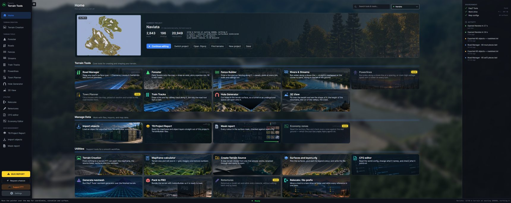
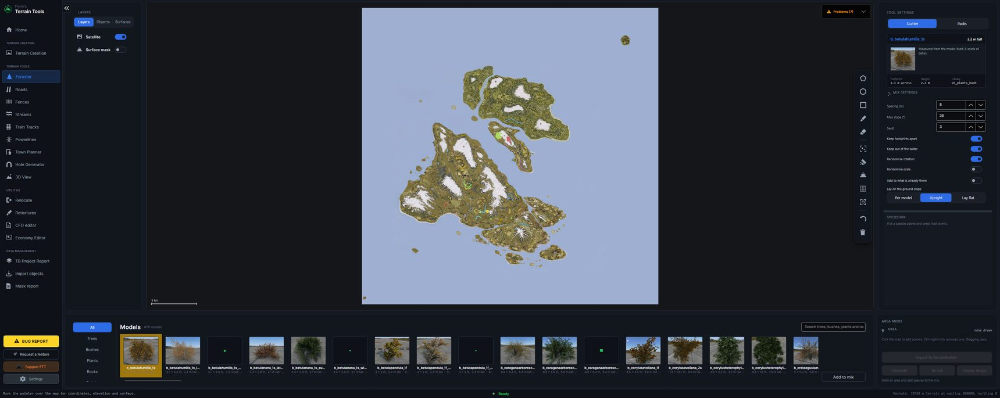
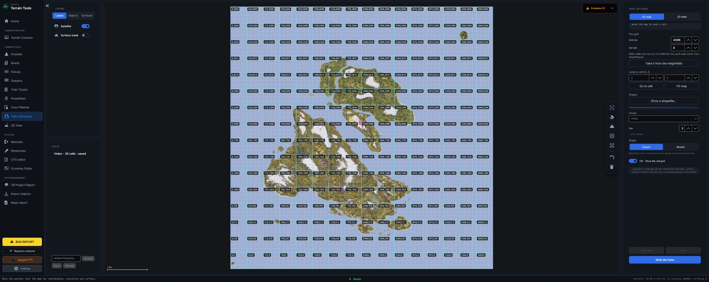
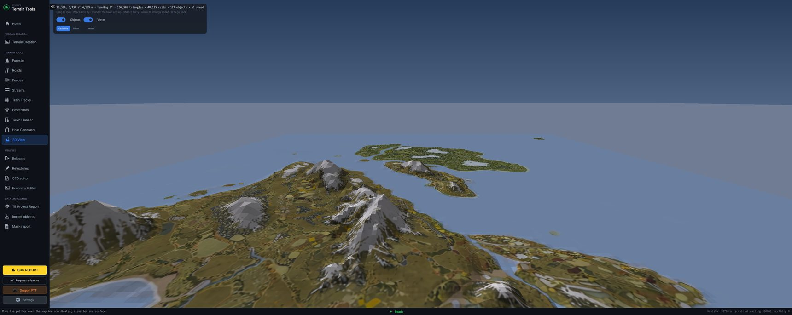

# Flynn's Terrain Tools — a guide

FTT sits beside TerrainBuilder. You draw on your terrain's satellite map, FTT works out where
thousands of objects go, and hands them back as an object list TerrainBuilder imports. It never
writes to your TerrainBuilder project.

This guide walks through one job end to end — open a terrain, check FTT picked the right files,
plant a wood, import it — then lists the other tools, the warnings you may see, and what to do
about them.

- [Before you start](#before-you-start)
- [First start](#first-start)
- [Open your terrain](#open-your-terrain)
- [Check the files FTT chose](#check-the-files-ftt-chose)
- [Plant a wood](#plant-a-wood)
- [Import it into TerrainBuilder](#import-it-into-terrainbuilder)
- [The other tools](#the-other-tools)
- [Model pictures](#model-pictures)
- [Warnings, and what to do about them](#warnings-and-what-to-do-about-them)
- [Controls](#controls)
- [Where FTT keeps things](#where-ftt-keeps-things)

---

## Before you start

- **64-bit Windows 10 or 11.**
- **DayZ Tools**, installed through Steam. FTT finds it itself.
- **A mounted `P:` work drive** with DayZ's data unpacked on it. `P:` is not a disk — it is a folder
  pretending to be a drive, so it disappears every time the machine restarts. Run Bohemia's
  `WorkDrive.exe`, or use **Mount work drive** in FTT's Settings.
- **A terrain**, or the [FTT sample](https://github.com/Naviata/FTT-Samples/releases) to start from.

FTT is one `.exe`. There is no installer: put it anywhere and run it.

---

## First start

FTT downloads the model pictures — around 600 MB — into `%APPDATA%\FTT\pictures`, in the background.
Until it finishes, models show as plain footprint tiles rather than pictures. You can work while it
downloads, and if it is interrupted it starts again next time.

It also checks for a new version each time it starts. When one is out you get a yellow
**Update available** button at the top of the window, and a note while it loads.

---

## Open your terrain

Home is where a session starts. Three ways in:

| Button | What it does |
|---|---|
| **Switch project** | Point at the `source` folder inside your terrain — the one holding `layers.cfg`. |
| **Find terrains** | FTT looks over the work drive and lists the terrains it finds. |
| **Open .fttproj** | An FTT project you saved before, with its file choices and saved areas. |
| **Save** | Writes a `.fttproj` beside your terrain, so choices and saved work are kept. |

Opening reads the heightfield, the satellite map, the surface mask, `layers.cfg` and every object
list already in `shapefiles`, then scans the model libraries. On a large terrain the first open
takes a minute; later ones are quicker, because the expensive parts are cached.

**What the card shows** is the terrain's name, its size, and counts of what is loaded. The right-hand
column says whether the work drive, DayZ Tools and the map configs are where FTT expects.

---

## Check the files FTT chose

A terrain often holds several heightmaps and several satellite maps, from different stages of the
work. FTT ranks them and picks one. When it picks wrongly, correct it rather than renaming files:

**Settings → PROJECT FILES**

Six rows — heightfield, satellite map, surface mask, `layers.cfg`, `config.cpp`, and the template
library folder. Each row has:

- a **dropdown of every matching file in the project**, so you can pick between them;
- the **full path** of the one in use, underneath;
- **Browse…**, for a file kept somewhere else entirely.

Your choice is saved in the project's `.fttproj` file, so it is made once. If your terrain has no
project file yet, the panel says so — save the project on Home to keep the choice.

> **Worth knowing:** FTT reads **BMP and PNG** imagery. A satellite map exported as TIFF, JPEG or a
> Photoshop file cannot be read; FTT will say so by name. Export it as a BMP.

---

## Plant a wood

**Forester** in the left menu.

1. **Mark the ground.** Use the tools down the left of the map:
   - *Area* — click corner by corner. Hold **Shift** to start a second, separate area.
   - *Brush* — drag to paint, and the eraser to take ground back.
   - *Circle* / *Rectangle* — press and drag out from the centre.
2. **Choose what grows there.** On the right, pick a plant pack (Norway spruce, European broadleaf,
   summer, winter, undergrowth) or search the model library and **Add to mix**. The mix at the
   bottom of that column is what gets planted; weights are normalised for you.
3. **Set the rules.** Spacing, maximum slope, keep out of the water, randomise rotation and scale,
   and whether models lie along the ground. A seed makes a generation repeatable — **Re-roll**
   changes it.
4. **Generate.** The trees appear on the map at the size of the models they stand for.
5. **Thin it out if you want.** *Pick* selects objects (drag a box for many, Ctrl-click to add);
   *Rub out* removes them as you drag. **Ctrl+Z** puts back the last thing you did.
6. **Export to TerrainBuilder.** Writes an object list `.txt` — put it in your terrain's
   `shapefiles` folder.

**Save the area** if you may come back to it: the shape and the whole mix are kept in the project,
and reopening it restores both.

---

## Import it into TerrainBuilder

In TerrainBuilder, import the `.txt` FTT wrote into a layer, the same way you would any object
list exported from TerrainBuilder itself.

**The one thing that catches people out:** an object list names *templates*, not models — that is
the format TerrainBuilder itself uses. TerrainBuilder resolves each name through the template
libraries **loaded in your project**. If a library is on disk but not loaded, the import stops with:

> Wrong file format or source template not found. Operation will now quit.

Load that library in the Templates panel and import again. FTT reads every `.tml` in the folder, so
it can offer models your TerrainBuilder project has not loaded yet.

---

## The other tools

Every one of these draws on the map and exports an object list the same way.

| Tool | What it does |
|---|---|
| **Roads** | Lay roads that snap together — junctions, street grids, sidewalks, lamps, signs, decals. Roads are saved so you can reopen and re-lay them. Click a node on a laid road to start another from it. |
| **Fences** | Panels, posts and gates along a drawn line. A gate replaces a panel, so the run stays the length you drew. |
| **Streams** | Water laid piece by piece, tilted to follow the fall of the ground, with a height above ground you set. |
| **Train tracks** | Straight track turned along the line, with the same overlap rule as water. |
| **Powerlines** | Poles at a spacing, or pre-assembled high-voltage spans with a tower on each corner. |
| **Town Planner** | Click buildings onto the map; they turn to line up with the nearest road. |
| **Hole Generator** | Mark terrain holes on the map or in 3D, and write them to `holes.cfg` for tunnels and underground spaces. |
| **3D View** | Fly over your own heightfield with the satellite map draped over it, in three looks: satellite, plain ground, mesh. |
| **Terrain Creation** | Mapframe calculator, start a terrain from the FTT sample, edit `layers.cfg` and `config.cpp`, check the navmesh, pack a PBO. |
| **Relocate** | Move a mod to a new name or place and relink every path inside it. |
| **Economy Editor** | Reads your CE territories and checks each zone against the real ground. |

---

## Model pictures

The pictures in the model library and the palettes are renders from
[Sam's Object Finder](https://samsobjectfinder.com). FTT downloads them on first start into
`%APPDATA%\FTT\pictures`.

Already have the pack, or want your own? **Settings → MODEL PICTURES → Import model pictures**
points FTT at a folder. It matches pictures to models by filename, ignoring the extension, and tells you
how many of the catalogue it matched — so a pack named some other way shows as *none matched*
straight away rather than as a library of blanks.

---

## Warnings, and what to do about them

FTT puts what it found under **Problems** on Home. Only real faults are listed there — choosing one
of several files, or counting what loaded, is not a fault and is not listed.

| What it says | What it means | What to do |
|---|---|---|
| *No satellite map FTT can read… this project has SatMap.tif* | Your imagery is in a format FTT does not read. | Export it as a BMP, or point at another file in Settings → PROJECT FILES. |
| *No model libraries found* | FTT was given a folder with no `.tml` files under it. | Open the terrain's `source` folder, or point at the library folder in Settings. |
| *all N objects fall outside the terrain* | An object list is in different coordinates — usually a raw UTM export. | Import it with an offset, or shift it in TerrainBuilder. |
| *N template name(s) refer to different models* | Two libraries use one name for different models. | An export using that name is ambiguous — drop one of the libraries. |
| *The work drive is not mounted* | `P:` is missing, so models and textures cannot resolve. | Settings → **Mount work drive**, or run `WorkDrive.exe`. |
| *Wrong file format or source template not found* (in TerrainBuilder) | The library naming those objects is not loaded in your TerrainBuilder project. | Load it in the Templates panel and import again. |
| *…missing the underground flag* (in TerrainBuilder) | A newer TerrainBuilder wants a column FTT does not write yet. | The import still works. It is being looked at. |

---

## Controls

Settings → **Show keybindings** lists these in the program. The ones worth knowing:

| | |
|---|---|
| **Left-click** | Place, or add a point |
| **Right-drag** | Pan the map |
| **Ctrl+right-click** | Undo the last point |
| **Shift** | Start a second shape while drawing |
| **Ctrl+Z** | Undo |
| **Ctrl-click** | Add to a selection |
| **Wheel** | Zoom |

---

## Where FTT keeps things

`%APPDATA%\FTT` — settings, the map and measurement caches, the model pictures, and the licences of
the open-source libraries FTT is built on. Settings → *Where FTT keeps its data* opens it, or moves
it somewhere else. Nothing in there is a terrain: deleting it costs a slow first open and nothing
else.

---

## Getting help

**BUG REPORT** and **Request a feature** in the left menu open the group's Discord. FTT is free and
always will be; if it saves you time, *Support the Build* links to Ko-fi.
