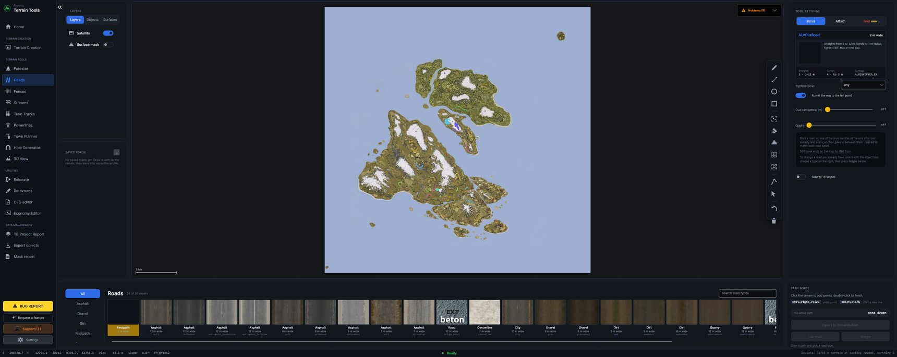

[← Guide](../GUIDE.md)

# Roads

Lays road pieces along a line you draw, so that each piece meets the next — with junctions,
sidewalks, lamps, signs, decals and a street-grid fill.

## Drawing and laying

Click the map to add points and double-click to finish. **Ctrl+right-click** takes the last point
back, **Shift+click** starts a second line, and the ring, rectangle and line tools draw those shapes
in one drag. One press of **Lay road** lays every line you have drawn.

Pick the **road type** from the pictures along the bottom bar: FTT reads every road family in your
template libraries and shows each one's texture. Only families with enough pieces to chain are
offered, so crosswalks and single junction pieces do not clutter the list.

**Export to TerrainBuilder** writes the object list, exactly as the Forester does.

## The bar, tab by tab

### Road

| Setting | What it does |
|---|---|
| **Tightest corner** | The sharpest corner the road may make. Larger gives sweeping bends; 0 allows every curve the type has. |
| **Run all the way to the last point** | Carries the road to the end of your line rather than stopping at the last piece that fits. |
| **Dual carriageway (m)** | Lays two roads either side of the line you drew, this far apart. |
| **Barrier down the middle** | Runs a crash barrier or concrete divider between them — one or two, and how far apart. |
| **Cracks** | Drops crack and patch decals on this share of the pieces, each turned at random. DayZ ships 105 of them. |

### Attach

Start a road from the blue handle at the end of one already laid and a junction goes in between,
picked to match both road types. **Snap to 15° angles** keeps drawn corners tidy.

To change a road you already have: pick it with the object tool, choose a type, then **Retype** — it
is re-laid along the line it already follows.

### Signs

| Setting | What it does |
|---|---|
| **Corner signs** | A warning sign before every bend sharper than the threshold. Which hand it is comes from the way the road actually turns. |
| **Sharper than** | How sharp a bend has to be to earn one. Default 25°. |
| **Speed signs** | DayZ ships two speeds and no others, so this is a choice between them. |
| **Spacing** | Metres of road between speed signs. |
| **Standing on** / **Turn them round** | Which side they stand, and which way they face. |
| **Place one by hand** | Click the map to put down the chosen sign. Ctrl+right-click takes it back. |
| **Add to picked road** | Signs a road already on the map. Pick it with the object tool first. |

### Sidewalks

Lays a sidewalk beside the road, set back by half the carriageway. Choose the family, **which side**,
and a **gap from the road**. **Add sidewalks** does it to a road already picked. Only the sidewalk
families FTT can measure exactly are offered; the rest are refused with the reason rather than laid
wrongly.

### Lamps

| Setting | What it does |
|---|---|
| **One every (m)** | Metres of road between lamps, measured along the road rather than across the map. |
| **Standing on** | Left, right, or both — which alternates them, so no two stand opposite each other and the spacing still means one lamp per so many metres. |
| **Back from the kerb (m)** | How far off the carriageway they stand. |
| **Add to picked road** | Lamps a road already on the map. |

Which way a lamp's arm reaches is set once per lamp type in **Settings → LAMP ARMS**.

### End caps

An end piece at the start, the finish, or both — and **Add to picked road** for one already laid.

### Junctions

Pick a laid junction with the object tool and **Change junction** turns a T into a crossroads or
back. **Add to the end of the picked road** puts one on a loose end, matched to both road types.
Only what FTT laid can be changed: a junction in an imported layer belongs to your TerrainBuilder
file.

### Grid — *coming soon*

Draw a rectangle, pick a road type for each direction, and fill the block with streets and the
junctions between them. It is greyed because DayZ's junction pieces only cover some pairs of road
types, so most grids would come out with bare crossings. The panel says which pairs are complete.

## Saved roads

Every road you lay is recorded with its line, type and settings, under **Saved roads** in the layers
column. Laying the same line in the same type again replaces its entry rather than adding another,
and a road can be renamed or forgotten. Opening one restores the line and the settings without
laying anything, so it cannot overwrite what you are working on.
