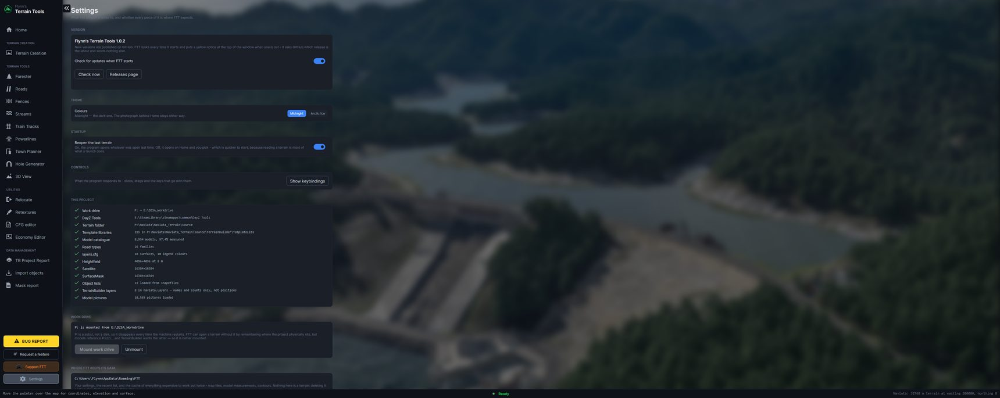

[← Guide](../GUIDE.md)

# Settings

## Version

Which version you are running, and whether a newer one is out. FTT asks GitHub every time it starts
and sends nothing else. **Check now** asks again; turn the switch off and it never asks.

When an update is out you get a yellow notice at the top of the window, a line here in yellow with a
**Download** button, and an offer on the loading screen before the tools appear.

## Theme

**Midnight** (dark) or **Arctic Ice** (light). The photograph behind Home stays either way.

## Startup

**Reopen the last terrain** — on, FTT opens whatever was open last time. Off, it opens on Home and
you pick, which is quicker to start, because reading a terrain is most of what a launch does.

## Controls

**Show keybindings** lists what the map responds to — clicks, drags and the keys that go with them.
The list is read from the program itself, so it cannot drift from what the tools actually do.

## This project

Every piece of the open terrain, ticked or crossed: the work drive, DayZ Tools, the terrain folder,
the template libraries and how many, the model catalogue and how much of it is measured, the road
types, `layers.cfg` and its surfaces, the heightfield, the satellite map and mask with their sizes,
the object lists, the TerrainBuilder layers, and the model pictures.

## Project files

The six locations a project depends on, each with a dropdown of every matching file found, the full
path of the one in use, and **Browse…** for a file kept elsewhere:

heightfield · satellite map · surface mask · `layers.cfg` · `config.cpp` · template libraries folder

FTT works these out when a terrain opens; this is how you overrule it without renaming or moving
anything. Your choice is kept in the project's `.fttproj`, so it is made once — and if the terrain
has no project file yet, the panel says the choice lasts only until FTT closes.

## Work drive

Whether `P:` is mounted, and what it points at, with **Mount work drive** and **Unmount**. `P:` is a
`subst`, not a disk, so it disappears every time the machine restarts. FTT can open a terrain
without it by remembering where the project physically sits, but models reference `P:\dz\…` and
TerrainBuilder wants the letter — so it is better mounted.

## Where FTT keeps its data

`%APPDATA%\FTT` — settings, the map and measurement caches, the model pictures, the debug symbols
and the third-party licences. **Open folder** shows it, **Move it…** puts it somewhere else (an SSD,
or off a drive that is filling up), and **Back to default** brings it home. Nothing in there is a
terrain: deleting it costs a slow first open and nothing else.

## Template libraries

How many libraries the open project has, and **Download them** — Flynn's measured libraries for the
whole DayZ asset set, written into this project's `TerrainBuilder\TemplateLibs`. Nothing already
there is replaced.

**Why measured matters:** a library TerrainBuilder has never loaded the model for carries a bounding
radius of −1 and bounds of 999/999/999 — a placeholder, not a measurement — and across a fresh
project that is most of them. These have been loaded, so the footprints are real, which is what lets
FTT space objects properly.

**Find models with no template** looks over the work drive for models no library names — after a
DayZ update, or with someone else's libraries — and **Add them to the project** measures each one and
writes them into `ftt_found_models.tml`. Load that library in TerrainBuilder before importing
anything that uses it.

## Model pictures

Where the pictures came from and how many matched. **Import model pictures** points FTT at a folder
of your own; it matches by filename, ignoring the extension, and reports the match rate rather than
showing you a library of blanks.

## Lamp arms

Which way each street lamp's arm reaches, as a turn in degrees. Import one, see which way it faces,
set it once, and every lamp FTT places afterwards is right. Only `lamp_city1` has been measured; the
others start from the same number.
