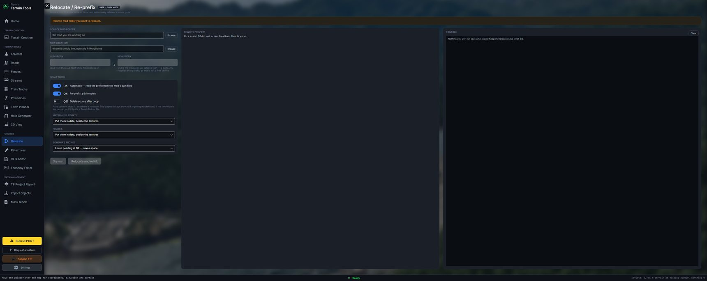
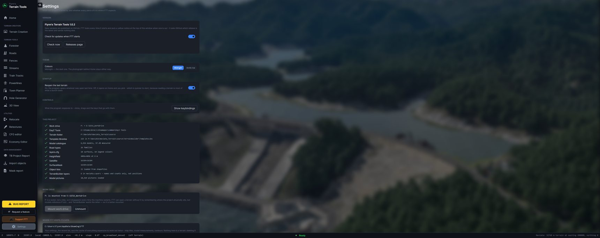

[← Guide](../GUIDE.md)

# Utilities and reports

## Relocate / Re-prefix

Moves a mod to a new drive, folder or name, and relinks every reference inside it — the texture and
material paths in each model, the texture paths in each material, and the `CfgPatches` class that
names the mod.

1. **Source mod folder** — the mod as it is now.
2. **New location** — where it is going. The **prefix** is read from where you put it, because that
   is what a prefix means on a work drive: paths resolve by it, so Object Builder and Buldozer only
   find the files if it matches the folder. Wanting the prefix `my_mod` means putting the mod at
   `P:\my_mod`.
3. **Where materials go** — into `data`, which is the usual layout, or gathered into `data\rvmats`.
   Names that would collide when flattened are reported rather than silently overwriting.
4. **Bohemia's proxies** are left pointing at `DZ\` unless you ask for them to come along: a copy is
   dead weight in everyone's download of something already on their disk.

**Dry run** lists every copy, every move and every relink before anything happens; the console shows
the same lines as it runs. It **copies**: the original is untouched, and *Delete source after copy*
asks before it does anything and refuses outright when the copy came back incomplete, when the two
folders are nested, or when the folder holds a TerrainBuilder file.

Each rewritten model is re-read afterwards and checked: same vertex count, same bounds, and exactly
the expected paths changed. One that fails is not written.

Binarised files are skipped with the reason — debinarise first.

## Import objects

Reads an object list `.txt` from TerrainBuilder and shows it on the map, so you can see what is
already placed while you work.

A file whose objects land outside the terrain is usually a raw UTM export that was never shifted in.
FTT says so and offers an offset rather than drawing them into the sea.

## Mask report

Walks every pixel of the surface mask and reports the colours in it against `layers.cfg`: what is
unmapped, what is a near miss, and which mapped surfaces are never painted. It is the ImageMagick
script most people run by hand, built in.

## TB Project Report

Reads your `.tv4p` and `.Layers`: the mapframe as TerrainBuilder states it, and every object layer
with its count, priority and whether it is visible.

**Object positions are not read from those files.** They live in a format that would have to be
reverse-engineered to be trusted, and a position 3% wrong on somebody's terrain is worse than none.
Export a layer to `.txt` from TerrainBuilder and use Import objects — that is exact.

## Economy Editor

Opens **RaG Economy Manager** by RaG Tyson, pointed at this terrain's own economy files rather than
empty. It needs Python with `tkinterdnd2` and `pillow`; the panel says what is missing and how to
install it.

It edits real files — work on a copy of the mission folder until you trust it. The author says so
too.

## Retextures — *coming soon*

Retexture a model set and relink every material, without editing each one by hand.
